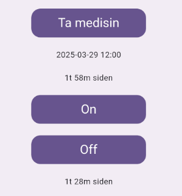

# Log screen / On Screen

## Init
On init
* Reads the last event of type "Ta medisin". The timestamp and duration between now() and that event's datetime is displayed under the Ta medisin button

* Reads the last event of any type. The duration between now() and that event's datetime is displayed under the On and off buttons

* Starts a timer that runs an empty setState every 10s, which will recalculate the durations based on a new now(), updating the two texts 

## Build
During the build-lifecycle method, a listener for [Statistics](../notifiers/statistics.dart) is initiated. the "listen" prop defaults to true, which causes the widget tree to listen to updates from this object.

## Subcomponents
- [Loggeknapp](../widgets/loggeknapp.md)