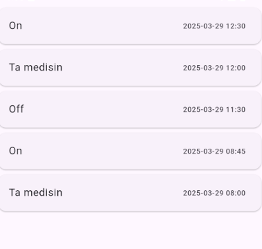

# View Screen

## Events
This screen has a listview with Dismissible events. 

## onDismissed
When the widget is swiped off the screen, the row with the same id is removed from the [database](../db/local_db_helper.md). The timestamp, id and 
A snackbar is displayed at the bottom, enabling the user to reinsert that event.
