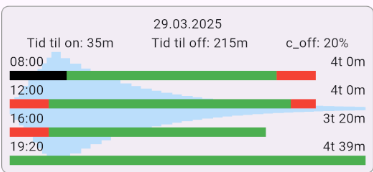

# Day stats widget

The events for each day are transformed into periods of On or Off in the [CalculateOnOff utililty method](../util/calculate_on_off.dart), giving a list of [MedOnOffLogs](../model/med_on_off_log.dart)

## Calculations done here
We find the longest duration between doses. The other periods between doses are scaled against this length to give an impression of relative lengths of time.

Times 
* until on after taking a dose
* until off again, after having been on after taking a dose 

And 
* the estimated concentration of medicine in the body when the On period ends and the Off period starts, relative to the dose, with previous doses also taken into account,

are extracted from the MedOnOffLogs. The averages of these are shown at the top.

## Screen elements
The Stack displays a [MedDilutionGraph](./med_dilution_widget.md) behind a Column of [MedOnOffWidgets](med_on_off_log_widget.md) with the above mentioned averages on top.